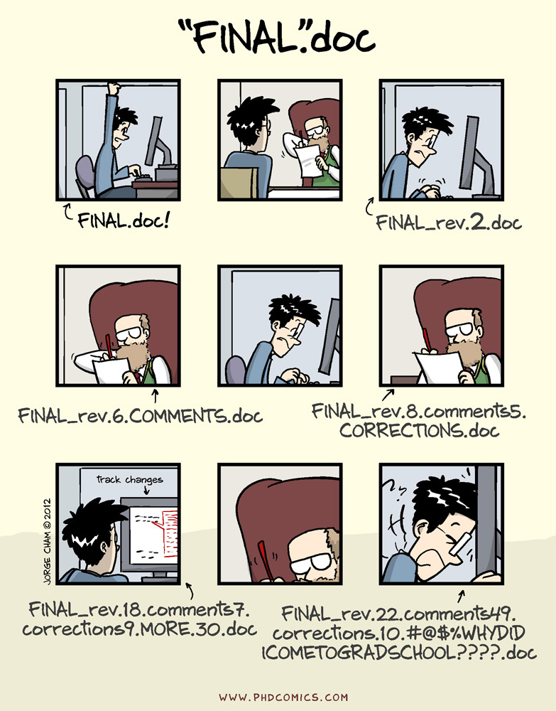

[reference material](https://git-scm.com/book/en/v2)

Since software management is not officially part of this course, we will only cover the very starting basics of using git, just enough to be comfortable with getting your course materials from github and saving your homework.


### Why use git?

 

### What is git?

Git is a free and open source distributed version control system designed to handle everything from small to very large projects with speed and efficiency. 

### What is github?

GitHub is an Internet hosting service for software development and version control using Git.

 

###  Let's start! Local software:

make sure that you have `git` installed.

initialize it (or it will complain the first time you do anything):

`git config --global user.name "Whatever Name"`
`git config --global user.email whatever@whatever`


### Remote: github

It's not a good idea to download the `.zip` with the new material every day. Let's learn to get it to your computer properly.

Since the course resopitory is public, you don't need a github account to clone it. Click the green "code" button and copy the `https` link. Then, in terminal, go to the location you want the course folder to be and do

```
git clone THE_LINK_YOU_COPIED
```

in our case, it's 

```
git clone https://github.com/sissa/ScientificPython_diploma23.git
```

Every day before the lecture (or when I tell you that I've updated the repository), you can do

```
git pull origin main
```

to update your folder. 

*Actually, .ipnb files are not really suited to be tracked with git as they are not "pure code". To avoid confusion and conflicts with the original files, I suggest to make a copy of each Lecture/Exercises notebooks and work in them, not the original ones.*


Now make an account on github.

Once you have it, click on "fork".


#### Passwordless access


Let's follow [instructions on github](https://docs.github.com/en/authentication/connecting-to-github-with-ssh/checking-for-existing-ssh-keys).

Once you've added your private key to github, lets test it.

Go to your fork repository, copy the `ssh` link, then do (replace SOME_FORK_NAME with something, I usually call it "mine" for my forks)

```
git remote add SOME_FORK_NAME SSH_LINK_TO_YOUR_FORK
```

Do 

```
git remote -v
```

You should see 4 lines now.

Create a folder for your homework now, add the notebook where you did the exercises yesterday to it.

Do

```
git status
```

It should show your file as "untracked". Let's tell git to track it, there is an `add` command for that.

```
git add YOUR_FILE
```

Now you need to "commit" the changes:

```
git commit -m "USEFUL MESSAGE"
```


`git push SHORT_NAME_YOU_CHOSE_FOR_YOUR_FORK_REMOTE main`

Check online if the changes got uploaded.

### Make your own repository

Since our repository is public, so are your forks. If you want your homework to not be accesible by anyone on the internet, you can make a separate private repository and keep your things there. Actually, it's a good idea to keep all your code for any projects backed up in some github repository.

Just go to github and follow visual instructions to create a new repository (choose "with README"), then 

`git clone YOUR_REPOSITORY`.


add some text file to it

`git push origin main` (pushing to main is actually a bad practice - only for "trash/back_up repositories" and learning purposes, but we are doing an introduction, so it's ok)

### Fun picture


### Gitignore


If you are sure that your `.gitignore` is good, you can just do 

```
git add -A
```

instead of adding files manually. Sooner of later you will push some trash like this, so only do it on your own repositories or if there are way too many files to add.


### Bonus - Now let's make a nice bash prompt

https://github.com/magicmonty/bash-git-prompt


## A little bit more info for those who want to become programmers one day:

### Create a branch

`git checkout -b development`

edit your text file, add and commit

`git push origin development`

go to github and you will see a "create a pull request" (that's how things should get to `main` in real repositories)

`git checkout main`

`git pull origin main` (to update main after github pull request has been merged)

### Merging manually

`git checkout development`

`git checkout -b new_branch`

edit the file again, add, commit, push to new_branch, switch back to development

`git merge new_branch`

check your text file

### Let's create conflict

edit the file in development, add, commit, push

edit the file in new_branch, add, commit, push

now try, while being in new_branch,

`git pull origin development`

What happens?


### conda

the best way to install Python and manage the environments is using `conda`. You can choose between `anaconda` and `miniconda`, the latter being preferable as it's much smaller (doesn't install much by default).

For windows, look for "anaconda prompt".

Once installed, to make sure you have the latest version, run

```
conda update conda
```

To create an environment, do (we specifically use an older version of python as the last one had a bug when working with conda and jupyter):

```
conda create --name my_new_env python=3.11
```

To activate:

```
conda activate my_new_env
```

To install packages (for example, numpy):

```
conda install numpy
```

Sometimes you would need to specify a "channel", but it's usually stated on the pages of the packages you are installing.

To see what you have installed:

```
conda list
```

To deactivate an environment:

```
conda deactivate
```

To view all the environments:

```
conda env list
```


